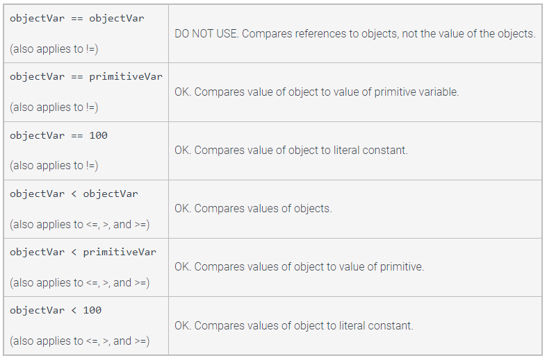
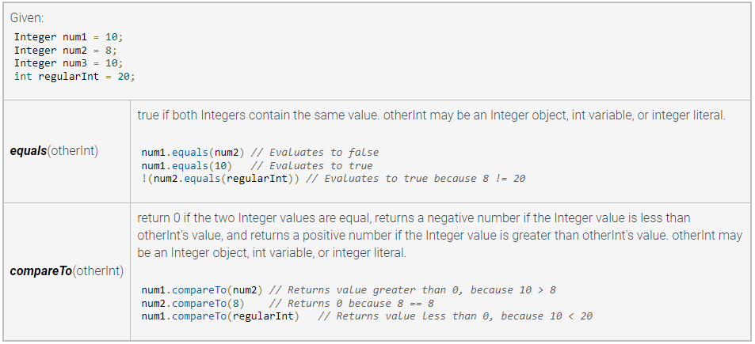

# Primitive and Reference Types

### Primitive Types:
Variable that "directly stores the data for that variable type."
- int
- double
- long
- char
- boolean

### Reference Type
Variable that "can refer to an instance of a class, also known as an object."

### Wrapper Classes:
"Built-in reference types that augment the primitive types."
Java has a few
- Integer
- Double
- Long
- Character
- Boolean

==Wrapper class objects are immutable.==

When reassigned, its memory reference is reassigned as well

