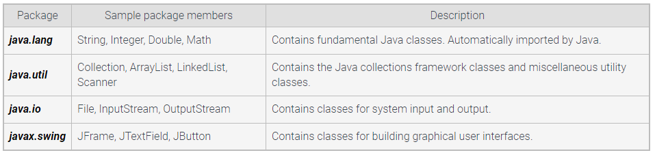

# Using Packages

a _Package_ is a group of related types, classes, interfaces, and subpackages.
the types, classes, and interfaces in a package are called _Package Members_.

java.lang is automatically imported

**Fully qualified name**
java.package.Class

you can:
import _fully-name_;
or
_fully-name_ variable = new _fully-name_();

even if you import, you can still use _fully-name_