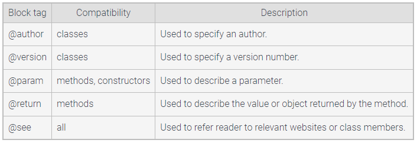

# Java Documentation for Classes

/**
*Java docs start with "/**"
*and end with... well I can't end it yet
* 
*java uses these tags:
*@author me, or whoever wrote the code
*@version the version
*@param varName explanation of what var means
*@return what the function really returns
*@see Class#methodName() used to refer users to related methods
*
*javadoc doesn't include private fields, by default
*/