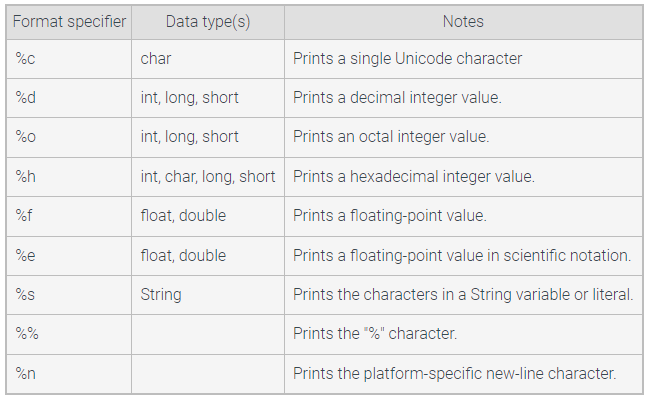
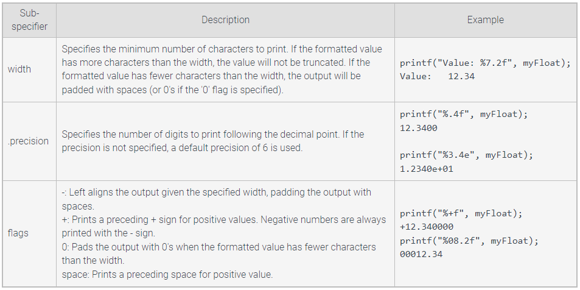
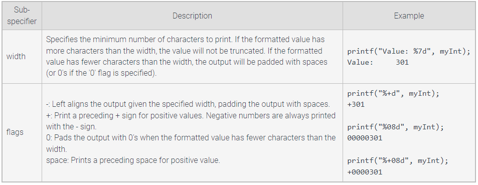
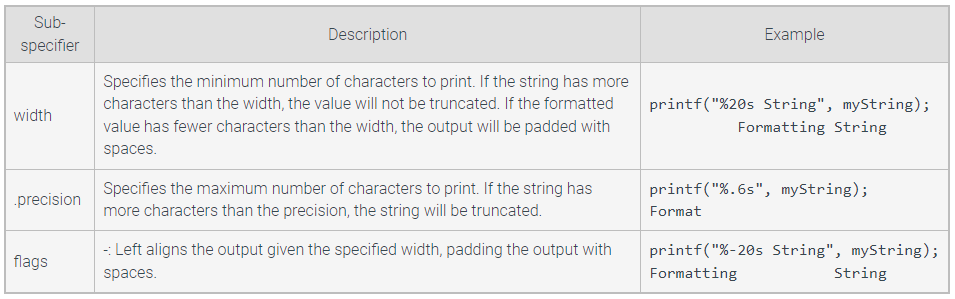

# Output Formatting

### printf()
- printf("String: %s | Decimal: %f | Integer: %d",
			stringVar, decimalVar, integerVar);
- **format specifiers** specify the typep of value to print in its place
- they begin with the %, followed by another character that indicates the value type to be printed

%e has default precision of 6

### Floating Point Values
==%(flags)(width)(.precision)specifier==
flags: +, -, 0
width: how many chars to print
precision: how many points after the decimal to print

### Integer Values
==%(flags)(width)specifier==
flags: +, -, 0
width: minimum chars to print

### String Values
==%(flags)(width)(.precision)specifier==
flags: -, 0
width: minimum chars to print
precision: determines when to truncate the string

